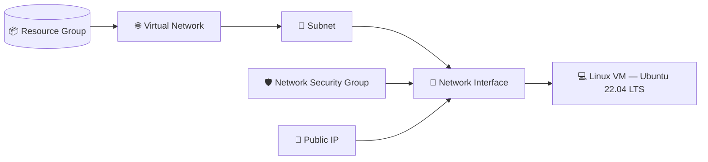
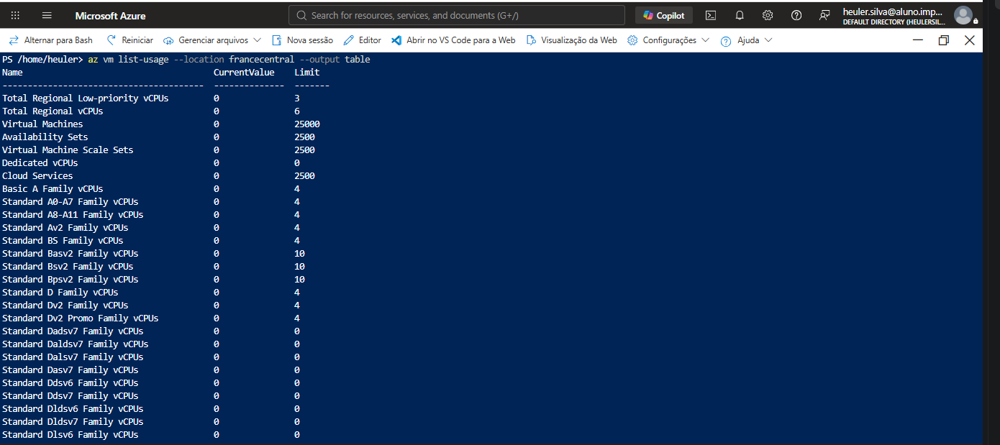
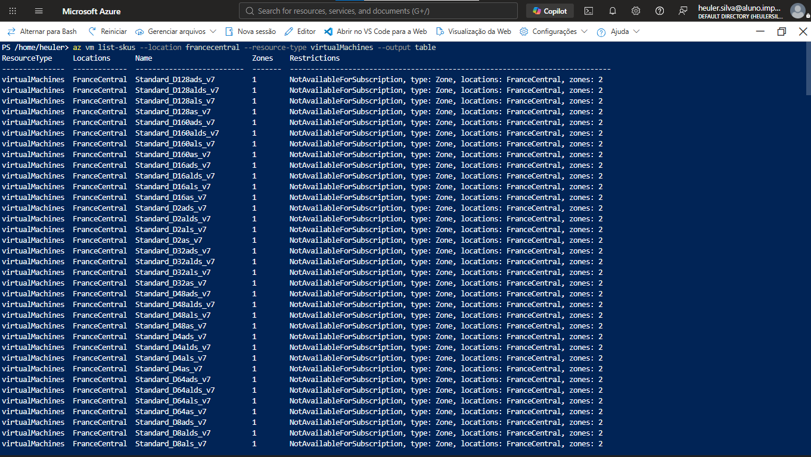
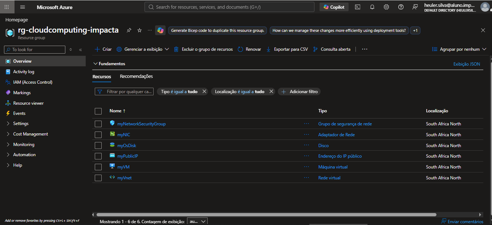
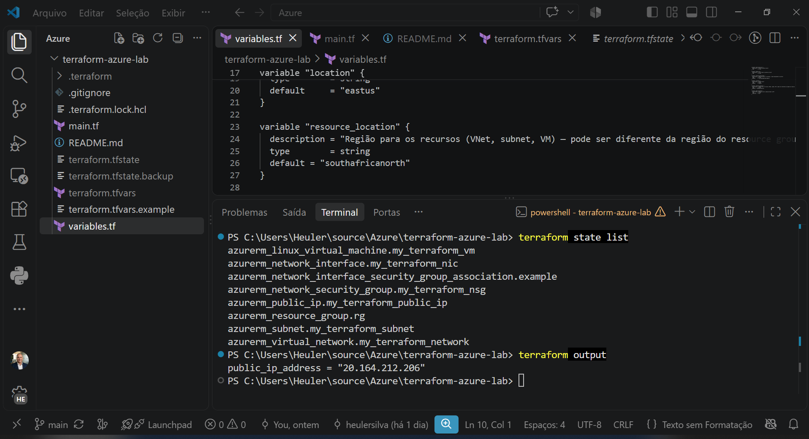
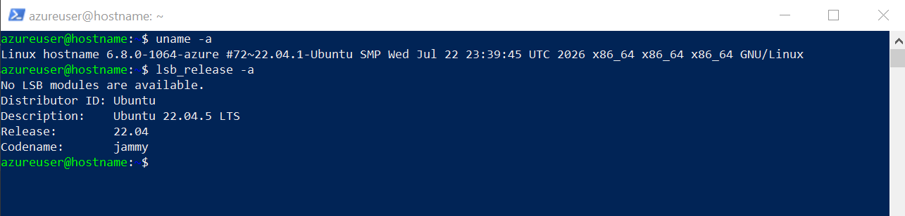

# 🏗️ Terraform + Azure — Laboratório de Infraestrutura como Código

[](https://www.terraform.io/)
[](https://registry.terraform.io/providers/hashicorp/azurerm/latest)
[](https://ubuntu.com/)
[]()

Provisionamento de infraestrutura Azure com Terraform (Infrastructure as Code), desenvolvido como parte da disciplina **Cloud Computing** da Pós-graduação em AI Engineering (Impacta).

Mais do que um exercício de sintaxe, este laboratório documenta um cenário real de engenharia de nuvem: como diagnosticar e contornar restrições de capacidade e catálogo de SKU em uma assinatura Azure for Students, usando Azure CLI e Terraform de forma sistemática — sem tentativa e erro às cegas.

---

## 🧱 Arquitetura provisionada



| Recurso | Finalidade |
|---|---|
| **Resource Group** | Contêiner lógico de todos os recursos |
| **Virtual Network + Subnet** | Rede isolada para a VM |
| **Network Security Group** | Libera acesso SSH (porta 22) |
| **Public IP** | Endereço de acesso externo |
| **Network Interface** | Ponte entre a VM e a rede |
| **Linux Virtual Machine** | Ubuntu 22.04 LTS, `Standard_DS2_v2` |

---

## 🔍 Desafio real: capacidade e catálogo de SKU no Azure for Students

Durante o provisionamento, os tamanhos de VM inicialmente planejados (`Standard_DS1_v2`, `Standard_DS2_v2`, `Standard_B1s`, `Standard_E2ads_v7`) falharam repetidamente com `Capacity Restrictions` em `brazilsouth` e `francecentral`, mesmo com cota de vCPU disponível. O diagnóstico não parou na mensagem de erro genérica da Azure — foi feito na origem, via Azure CLI:

```bash
# Confirma cota real da assinatura, por família, na região
az vm list-usage --location francecentral --output table

# Confirma quais SKUs a região realmente oferece hoje, e com que restrição
az vm list-skus --location francecentral --resource-type virtualMachines --output table
```

**Causa raiz identificada:** a assinatura tinha cota livre (4 vCPUs) nas famílias `Dv2`/`DSv2`/`Ev3`/`F`/`FS`/`G`/`LS` — mas `francecentral` e `mexicocentral` haviam descontinuado essas gerações de SKU do catálogo regional. Não era falta de capacidade pontual, era descontinuação de linha de produto. A correção não foi "tentar outro tamanho às cegas", foi comparar o catálogo de SKUs entre as cinco regiões liberadas pela política da assinatura e migrar a infraestrutura para uma região (`southafricanorth`) que ainda mantém o catálogo completo de gerações antigas.

> 💡 **Lição de engenharia:** "Capacity Restrictions" na Azure pode significar três coisas diferentes — falta de estoque real, cota da assinatura, ou descontinuação de SKU na região — e cada uma exige um diagnóstico e uma correção diferente. Tratar as três como a mesma coisa custa tempo.

<table>
<tr>
<td width="50%">

**Cota livre, mas SKU descontinuado no catálogo:**


</td>
<td width="50%">

**A mesma família, restrita em `francecentral`:**


</td>
</tr>
</table>

---

## ⚙️ Como rodar

**Pré-requisitos:** [Terraform](https://developer.hashicorp.com/terraform/downloads) ≥ 1.5, [Azure CLI](https://learn.microsoft.com/cli/azure/install-azure-cli), assinatura Azure ativa.

```bash
# 1. Configure suas credenciais
cp terraform.tfvars.example terraform.tfvars
# preencha subscription_id, tenant_id e admin_password

# 2. Autentique na Azure
az login

# 3. Inicialize o Terraform
terraform init

# 4. Valide a configuração
terraform validate

# 5. Revise o plano de execução
terraform plan

# 6. Aplique
terraform apply
```

## 🧹 Encerrando o laboratório

Para não gerar custo com recursos ociosos:

```bash
terraform destroy
```

---

## ✅ Resultado final

VM provisionada e validada de ponta a ponta: infraestrutura criada pelo Terraform, acesso SSH confirmado, sistema operacional saudável.

<table>
<tr>
<td width="33%">

**Recursos ativos no Resource Group:**


</td>
<td width="33%">

**Estado do Terraform + IP de saída:**


</td>
<td width="33%">

**Acesso validado via SSH:**


</td>
</tr>
</table>

---

## 🛠️ Stack

`Terraform` · `Azure Resource Manager` · `Azure CLI` · `Ubuntu Server 22.04 LTS` · `SSH`

## 👤 Autor

**Heuler Silva** — Data & AI Engineer